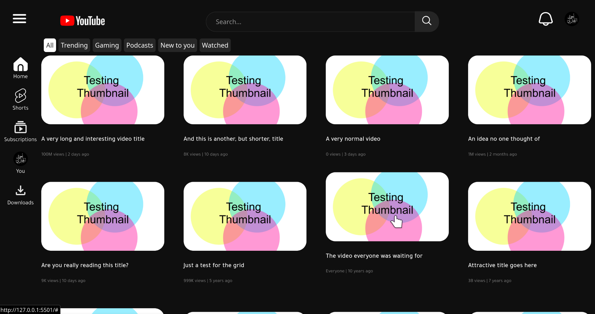

### مشروع استنساخ واجهة يوتيوب (YouTubeUI Clone Project)


##### تم انشاء هذا المشروع لهدف التعليم وصقل مهاراتي في لغتي `html`و`css`
##### عملت على هذا المشروع البسيط في وقت فراغي وهو اول مشروع مكتمل لي في هاتين اللغتين واستغرق العمل عليه حوالي 10 ايام بمدة عمل قصيرة لكل يوم وواجهت بعض الصعوبات اثناء انشائه نظرا لقلة خبرتي في مجال الواجهات الامامية

---

## 🚀 المعاينة الحية (Live Demo)

يمكنك مشاهدة النسخة الحية من المشروع على الرابط التالي:

[**اضغط هنا للمشاهدة**](https://al-jbri.github.io/youtubeUI-clone/)


---

## ✨ الميزات الرئيسية

* **تصميم متجاوب بالكامل:** تم بناؤه ليعمل على مختلف أحجام الشاشات، من الجوال إلى الكمبيوتر
* **تخطيط حديث وواضح:** استعملت بشكل اساسي الشبكات (CSS Grid) والصناديق المرنة (Flexbox) لبناء الموقع
* **أنيميشنز خاصة:** تم اضافة بعض الحركات الجرافيكية البسيطة بهدف صقل مهاراتي في عمل الرسوم المتحركة في css
* **كود نظيف:** حاولت بقدر استطاعتي المحافظة على امكانية الوصول وتنضيف الكود قدر المستطاع.

---

## 🛠️ التقنيات المستخدمة

* **HTML5:** لبناء هيكل الصفحة الدلالي.
* **CSS3:** للتنسيقات المتقدمة، بما في ذلك:
    * **CSS Grid** (لتخطيط الصفحة الرئيسي).
    * **Flexbox** (لتنسيق العناصر الداخلية مثل الهيدر والكروت).
    * **Media Queries** (للتصميم المتجاوب).
    * **CSS Animations & Transitions** (للتأثيرات الحركية).

---

## 📂 كيفية تشغيل المشروع محلياً

المشروع عبارة عن ملفات HTML و CSS ثابتة ولا يحتاج أي تثبيت.

1.  قم باستنساخ المستودع (Clone the repo):
    ```bash
    git clone https://github.com/al-jbri/youtubeUI-clone
    ```
2.  افتح ملف `index.html` في المتصفح المفضل لديك.
